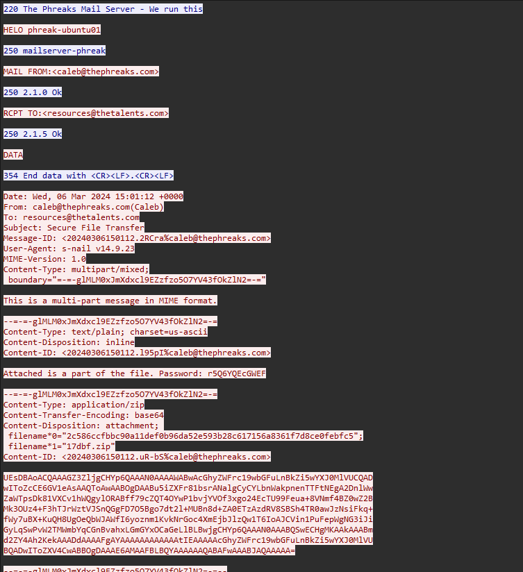
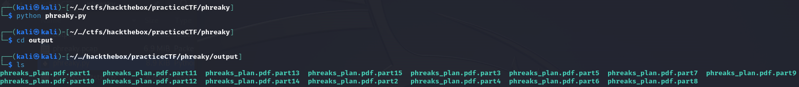

# phreaky - forensics

## Context

Given a standalone pcap file `phreaky.pcap`.

## Solution

My first step any time I see a packet capture is to trace the TCP stream. So, I initially identify the first TCP packet number 8 , right click, hit 'follow', and then 'TCP stream':

Clicking through the TCP stream, we can see the encrypted TLS communications, as well as traffic taking place over the mail server. This traffic is what is interesting, as we can see the emails contain a part of a zip file, as well as the respective password to unzip it:



Checking all the TCP messages reveals 15 parts, and 15 passwords. I stored these all in a text document and began to work on a code file to decrypt and reassemble the original document:

```python
import base64
import zipfile
import io

cipher = [0, "UEsDBBQACQAIAGZ3ZlhwRyBT2gAAAN0AAAAWABwAcGhyZWFrc19wbGFuLnBkZi5wYXJ0MVVUCQADwIToZcCE6GV1eAsAAQToAwAABOgDAAA9mPwEVmy1t/sLJ62NzXeCBFSSSZppyIzvPXL++cJbuCeLnP4XXiAK9/HZL9xRw4LjlDf5eDd6BgBOKZqSn6qpM6g1WKXriS7k3lx5VkNnqlqQIfYnUdOCnkD/1vzCyhuGdHPia5lmy0HoG+qdXABlLyNDgxvB9FTOcXK7oDHBOf3kmLSQFdxXsjfooLtBtC+y4gdBxB4V3bImQ8TB5sPY55dvEKWCJ34CzRJbgIIirkD2GDIoQEHznvJA7zNnOvce1hXGA2+P/XmHe+4KtL/fmrWMVpQEd+/GQlBLBwhwRyBT2gAAAN0AAABQSwECHgMUAAkACABmd2ZYcEcgU9oAAADdAAAAFgAYAAAAAAAAAAAAtIEAAAAAcGhyZWFrc19wbGFuLnBkZi5wYXJ0MVVUBQADwIToZXV4CwABBOgDAAAE6AMAAFBLBQYAAAAAAQABAFwAAAA6AQAAAAA=", 
        "UEsDBAoACQAAAGZ3ZljgCHYp6QAAAN0AAAAWABwAcGhyZWFrc19wbGFuLnBkZi5wYXJ0MlVUCQADwIToZcCE6GV1eAsAAQToAwAABOgDAABu5iZXFr81bsrANalgCyCYLbnWakpnenTTFtNEgA2DnlWwZaWTpsDk81VXCv1hWQgylORABff79cZQT4OYwP1bvjYVOf3xgo24EcTU99Feua+8VNmf4BZ0wZ2BMk3OUz4+F3hTJrWztVJSnQGgFD7O5Bgo7dt2l+MUBn8d+ZA0ETzAzdRV8SBSh4TR0awJzNsiFkq+fWy7uBX+KuQH8UgOeQbWJAWfI6yoznm1KvkNrGoc4XmEjbJlzQw1T6IoAJCVin1PuFepWgNG3iJiGyLqSwPvW2TMWmbYqCGnBvahxLGmGYxOCaGeLlBLBwjgCHYp6QAAAN0AAABQSwECHgMKAAkAAABmd2ZY4Ah2KekAAADdAAAAFgAYAAAAAAAAAAAAtIEAAAAAcGhyZWFrc19wbGFuLnBkZi5wYXJ0MlVUBQADwIToZXV4CwABBOgDAAAE6AMAAFBLBQYAAAAAAQABAFwAAABJAQAAAAA=", 
        "UEsDBAoACQAAAGZ3ZljJKeGm6QAAAN0AAAAWABwAcGhyZWFrc19wbGFuLnBkZi5wYXJ0M1VUCQADwIToZcCE6GV1eAsAAQToAwAABOgDAAClpsW/gto1vxt+rZZjVotnhKoaNhhzOz+MdqxCcWHfda7pXXkbFXwaA/lANMOcS7/LrFRxqTVqGkTbUDIexbC3kO7dyjJVPXkqPqOwHAXA2o/jq2ORUsdeIaNeZOG/9PGdtOZmeGQowZCDfCHii576VwQBRAV+1G8Xe1rLphPsBCD9uBQ58EUigH0HEanGU6NW6zgfH9ZPlEPHg9AXMuLmLxnqyh3wU13xQYNwSgF1OJhdoZgsVaJBbX83/oI8gDjh9jynVpzAKjQXgTM03sYhCJjIbW1O43JCisFUi4ShUiYXCbzcmWhxjVBLBwjJKeGm6QAAAN0AAABQSwECHgMKAAkAAABmd2ZYySnhpukAAADdAAAAFgAYAAAAAAAAAAAAtIEAAAAAcGhyZWFrc19wbGFuLnBkZi5wYXJ0M1VUBQADwIToZXV4CwABBOgDAAAE6AMAAFBLBQYAAAAAAQABAFwAAABJAQAAAAA=", 
        "UEsDBAoACQAAAGZ3Zli+QTv+6QAAAN0AAAAWABwAcGhyZWFrc19wbGFuLnBkZi5wYXJ0NFVUCQADwIToZcCE6GV1eAsAAQToAwAABOgDAAASGvRLBBhSc/guGlGU5sHR93zRJxtXsVmpNt415MT1krF1B5YPQEIsi3FpQN+Orr7llB/k2ziA5dzioeBZ8ZXuwB61k/TVVI3I3oop9op3Cl6BpTwc99yWesYbyuad4N2buPTxOCgy43KOuPG9eide3qXHkkt9L8oJ3ZNR+qOU+F5CmE38A0tvWml/XC2/2DSwRI2AXVQD9TD2WF26V17kUKAImuZPrOfYmB8pp0hrxAI9Ja62mYz+EIjqr51Ms457EiJi4Ia6D0Lm3jcrPsKeCHUlJNCzj08AWSBfZqvhr3+JIBVXHebiSFBLBwi+QTv+6QAAAN0AAABQSwECHgMKAAkAAABmd2ZYvkE7/ukAAADdAAAAFgAYAAAAAAAAAAAAtIEAAAAAcGhyZWFrc19wbGFuLnBkZi5wYXJ0NFVUBQADwIToZXV4CwABBOgDAAAE6AMAAFBLBQYAAAAAAQABAFwAAABJAQAAAAA=", 
        "UEsDBAoACQAAAGZ3ZlhKc9CT6QAAAN0AAAAWABwAcGhyZWFrc19wbGFuLnBkZi5wYXJ0NVVUCQADwIToZcCE6GV1eAsAAQToAwAABOgDAACgXw6/ilp0wNpzWRKketbF/ZStw53n68tQVXonvsbCXld2+hEU8oOGDJmNqJPxK7b6qScipwQBuaP7aisMHTGpC5otz0y3zSHKPIRjphFkQPHDEU9gCHmSfNTIc/kWvaDyDWFJY7rfz2QOkQnmY4Wa8uefTXU/0O9X1FCh77dlADxvUoTXwIfMJ/7c6L+cD76gC3BNh5ajhYC6o+4p3XXCaum4x1ETaNUyc44hPHEr6tykoaBawkqaQ+qU39Z89cJRUeYWTr8sKjGPN+f0fa72ALXAxdCEzfZV4rvVTgJTq+IjyScxniKdYFBLBwhKc9CT6QAAAN0AAABQSwECHgMKAAkAAABmd2ZYSnPQk+kAAADdAAAAFgAYAAAAAAAAAAAAtIEAAAAAcGhyZWFrc19wbGFuLnBkZi5wYXJ0NVVUBQADwIToZXV4CwABBOgDAAAE6AMAAFBLBQYAAAAAAQABAFwAAABJAQAAAAA=", 
        "UEsDBBQACQAIAGZ3Zlgub1pG0gAAAN0AAAAWABwAcGhyZWFrc19wbGFuLnBkZi5wYXJ0NlVUCQADwIToZcCE6GV1eAsAAQToAwAABOgDAAA9siVDz34UldbdpmALh3n3JpC5DSTu5/F8fuitjI/IDhbWyDabhamKNp1fsz7hThUnyS6ibIdFtg+YKTm+Tg8Xba1jM0AAf7r/dIGjDciCXGpH2IzkV/7qgbK25jIufslNzO0T3tCviOj4q5un2zfP+wPxD8cozyoXPmk53btd+Tyt7eGbQ8r9LaLSAxl+LXrUWe9LrxeNTDehMoP+oYG2Wp/xW4Xe7cVHSyXYFa1C/6Fs/uZZv2d1N7+jDBCOpFNSUfwMLeNQSZ3js6RU+DjUWARQSwcILm9aRtIAAADdAAAAUEsBAh4DFAAJAAgAZndmWC5vWkbSAAAA3QAAABYAGAAAAAAAAAAAALSBAAAAAHBocmVha3NfcGxhbi5wZGYucGFydDZVVAUAA8CE6GV1eAsAAQToAwAABOgDAABQSwUGAAAAAAEAAQBcAAAAMgEAAAAA", 
        "UEsDBAoACQAAAGZ3ZliZDy8d6QAAAN0AAAAWABwAcGhyZWFrc19wbGFuLnBkZi5wYXJ0N1VUCQADwIToZcCE6GV1eAsAAQToAwAABOgDAABXkaLlWGcXvDvGXeqNTsDAfvEc0lKQeoBVqOF5aqn75cy8eZVLxqVop4NixzQkNL6cin9cay5McTdKjBoMfkwTgaRuOAJu0Q1ZrSUYeBE1fO4Y8kqGIyty81Gtg2KlMNSc4O+5KAHlPKpimef/g5TaP1Tv4MrmGXEsNeAgjoJqwayDBFXVAW8N6Kr+9wDY4TTBOTsVMN3ZKVML0bU4ng6Z9kV3wLGPiD3aHUBn1STqWv6y2xWJkQapaQ9UDpgLLszjOe1lbReRMypw6mjiK1sVjNPlXFgvlhs0CBrHtKuXHXw5GVK6KT7ntlBLBwiZDy8d6QAAAN0AAABQSwECHgMKAAkAAABmd2ZYmQ8vHekAAADdAAAAFgAYAAAAAAAAAAAAtIEAAAAAcGhyZWFrc19wbGFuLnBkZi5wYXJ0N1VUBQADwIToZXV4CwABBOgDAAAE6AMAAFBLBQYAAAAAAQABAFwAAABJAQAAAAA=", 
        "UEsDBAoACQAAAGZ3Zlhtggyo6QAAAN0AAAAWABwAcGhyZWFrc19wbGFuLnBkZi5wYXJ0OFVUCQADwIToZcCE6GV1eAsAAQToAwAABOgDAAAdQnVCaWFrDEjWzqeKKB2AMYPFi420ZNqxM1yPqH5JisD8HNTACyex0E/ba1jNeoh/EbXy+7QIYZwB8Nw34uwQeXEeY2Fh46RBMBERIqI/jiT7YWorDyD+D+1jdH/IBP1wDmvqtJbLTBz5dj2S+Om0GcvGpv7sSNa9shl0/FIvW3uOBorbQ8cpTh5D01vRxfFGw6v4JBlGhwQLTGPS0EGxD6U/Uogrfwy23E7q+HI6cMPCOuVBTyMHiDj5itTTFKNyZYrAMQkX1OL07I3lgeTWK6IqlYlQO3rT4jPnNA+F+nh6fF0pwZCKMlBLBwhtggyo6QAAAN0AAABQSwECHgMKAAkAAABmd2ZYbYIMqOkAAADdAAAAFgAYAAAAAAAAAAAAtIEAAAAAcGhyZWFrc19wbGFuLnBkZi5wYXJ0OFVUBQADwIToZXV4CwABBOgDAAAE6AMAAFBLBQYAAAAAAQABAFwAAABJAQAAAAA=", 
        "UEsDBAoACQAAAGZ3ZlipN5HW6QAAAN0AAAAWABwAcGhyZWFrc19wbGFuLnBkZi5wYXJ0OVVUCQADwIToZcCE6GV1eAsAAQToAwAABOgDAAC7ogPIZPn1boqWXs0fYT9Vq2J2SU/WbuEgNKh8cdDmyc2Qhnk6dfTmyAh0o506e7y90gVhhH2q6ZMIJZ7DGZkC0rJuzB9H9LSKIEaPBChF08Teb2rqQ+wuWh9Bw/wl+7t9nxygjPp7uiiHvZUYVf15u6v9/HkmC5g1wM/6RmUHtez4eidH6Ev/3XfLQr82p6PUWwY+/OXxFPlNBsif0uqQ/PQLOw8ju/7AfvMJwKI7FR7QHVwGMI/Yg4vJ9PFb21NGU0wmv2HkBtjUvly5FDQuNIqxyy+bA9W11u83okQnfj8TAQTcv97C9lBLBwipN5HW6QAAAN0AAABQSwECHgMKAAkAAABmd2ZYqTeR1ukAAADdAAAAFgAYAAAAAAAAAAAAtIEAAAAAcGhyZWFrc19wbGFuLnBkZi5wYXJ0OVVUBQADwIToZXV4CwABBOgDAAAE6AMAAFBLBQYAAAAAAQABAFwAAABJAQAAAAA=", 
        "UEsDBAoACQAAAGZ3Zlj/Gb5u6QAAAN0AAAAXABwAcGhyZWFrc19wbGFuLnBkZi5wYXJ0MTBVVAkAA8CE6GXAhOhldXgLAAEE6AMAAAToAwAA22IkVozT4hpv67dNaBas9lborysg+A87Nq9ckagEYzZf6R881phUvE8tVImHS4p8pdcmlfnz+icS0+CeENKNQFhJMlHl6jxDyKI4LbzJ2+YWZ/zxaQ2/AMR6GykbDScNlnGtlXOcXe+RDYCrgLgB1iAMLvziMF27db2C9opPLx/x8l+FiQ0Gogn6H4RKjbh9SDOkqzGENuXmo46TlISrjIFBMPvsYpcKHDknDxgHPZvejQj4DZOe//3Qyvksr5xsNIQCx/ezXJVZKqDkUm2D9GsQjGcN8kmCQbxpbYq64iOkYj/fgcptZWZQSwcI/xm+bukAAADdAAAAUEsBAh4DCgAJAAAAZndmWP8Zvm7pAAAA3QAAABcAGAAAAAAAAAAAALSBAAAAAHBocmVha3NfcGxhbi5wZGYucGFydDEwVVQFAAPAhOhldXgLAAEE6AMAAAToAwAAUEsFBgAAAAABAAEAXQAAAEoBAAAAAA==", 
        "UEsDBBQACQAIAGZ3Zlg68XpvyAAAAN0AAAAXABwAcGhyZWFrc19wbGFuLnBkZi5wYXJ0MTFVVAkAA8CE6GXAhOhldXgLAAEE6AMAAAToAwAA1XFxuJqaVlE3BajxvkjKFU1UNArCCd046Zq3hSv3YQq35vkNnyX2RgCWLO8+IMONpTPAeu8lrkrLU0dyNmk4qZayus+5yfEi8/YCmAgf0PqAoUZq81/8MJ3q/zvIPUIKqy+P7V6EUEy3EXIvexGB9r5vI5Vuyx/y00ct3/ooluaHjBRmmHxxotAm9vl+kJWqmJou9fKDg/RVQX5GUNUZ1XNeBD3HBzZqjZOVkDS1iWI8FCUBtE8reYicAN8vN1+4n9zHYa0FM/lQSwcIOvF6b8gAAADdAAAAUEsBAh4DFAAJAAgAZndmWDrxem/IAAAA3QAAABcAGAAAAAAAAAAAALSBAAAAAHBocmVha3NfcGxhbi5wZGYucGFydDExVVQFAAPAhOhldXgLAAEE6AMAAAToAwAAUEsFBgAAAAABAAEAXQAAACkBAAAAAA==", 
        "UEsDBBQACQAIAGZ3ZliBNT+KdgAAAN0AAAAXABwAcGhyZWFrc19wbGFuLnBkZi5wYXJ0MTJVVAkAA8CE6GXAhOhldXgLAAEE6AMAAAToAwAAC1oSkzON6LaRSbMM8vLsHs98l9V2fmaQYuimQLQJ0GOKCJRSbEDrUnGuzivL1Dm1dKvE0iAYhxBrZrBq1Lr91Ctg0SGitmPxBBmdR176EhK/OOyJnf/Ai9SzC83F95FwRROsD6bwYiHLusjRH/JvgCdRZAZm/1BLBwiBNT+KdgAAAN0AAABQSwECHgMUAAkACABmd2ZYgTU/inYAAADdAAAAFwAYAAAAAAABAAAAtIEAAAAAcGhyZWFrc19wbGFuLnBkZi5wYXJ0MTJVVAUAA8CE6GV1eAsAAQToAwAABOgDAABQSwUGAAAAAAEAAQBdAAAA1wAAAAAA", 
        "UEsDBBQACQAIAGZ3ZljaTDFBtwAAAN0AAAAXABwAcGhyZWFrc19wbGFuLnBkZi5wYXJ0MTNVVAkAA8CE6GXAhOhldXgLAAEE6AMAAAToAwAAl+DA7wLy9OkCv23NgbCEuvpekfQ7hu6Se0qee2Byf6bi55r/fnWy8lJbZw4sNuTUBnenVqY5UlFBdLxxf2a6111UTC9x/af72AA/jpFvXAr5MAG61f/1Dk7udSZcep0pKj4IG9/7A8ukd8BmVSfhkJUSlIP3N8lrG4XxaL6z0zmzhNr+ATd2bfI2Dnzb9rb7atrJc+2tPkn7BrziI8X3oEniBlCK57cs5Clh4032UNQ4EVx69ty4UEsHCNpMMUG3AAAA3QAAAFBLAQIeAxQACQAIAGZ3ZljaTDFBtwAAAN0AAAAXABgAAAAAAAEAAAC0gQAAAABwaHJlYWtzX3BsYW4ucGRmLnBhcnQxM1VUBQADwIToZXV4CwABBOgDAAAE6AMAAFBLBQYAAAAAAQABAF0AAAAYAQAAAAA=", 
        "UEsDBBQACQAIAGZ3ZlgEvqDrmwAAAN0AAAAXABwAcGhyZWFrc19wbGFuLnBkZi5wYXJ0MTRVVAkAA8CE6GXAhOhldXgLAAEE6AMAAAToAwAAKhCv8Ho5I1TZfENnfcarT/3gQrsDqxJ/oAidzEbvaiuJDzGdsQShRTZU8OnTwM8z0rpOusv8RovXzLvb099ai+q7J/AHTNDrTK3WxFqaJ1xGSZH1DNQIHkp70K8l3JT2Ln1zGJ/GpW2fcFNehGxTlUzyH+cNWThPU1OPWFeDrGEpTtkVUTLO1X9lt14dpG5qD1FRtC8AbLygCNZQSwcIBL6g65sAAADdAAAAUEsBAh4DFAAJAAgAZndmWAS+oOubAAAA3QAAABcAGAAAAAAAAQAAALSBAAAAAHBocmVha3NfcGxhbi5wZGYucGFydDE0VVQFAAPAhOhldXgLAAEE6AMAAAToAwAAUEsFBgAAAAABAAEAXQAAAPwAAAAAAA==", 
        "UEsDBBQACQAIAGZ3ZlglJqgafwAAANAAAAAXABwAcGhyZWFrc19wbGFuLnBkZi5wYXJ0MTVVVAkAA8CE6GXAhOhldXgLAAEE6AMAAAToAwAAFdeY2PjWsfwq91s17mJp5mZWNDs6FOqHJv5Oj2MEfSdKnPpoBa4LJ2Fdtg4E//+SEV8EGeCnMwPsVlG872uVrdPglKNX/78RUrsLQOGssFBOexBskItytFA0ueb9HwsYpD4tmg059QVlsp1JF9ChY03Mj5svIAYT6PWRSqUGXFBLBwglJqgafwAAANAAAABQSwECHgMUAAkACABmd2ZYJSaoGn8AAADQAAAAFwAYAAAAAAABAAAAtIEAAAAAcGhyZWFrc19wbGFuLnBkZi5wYXJ0MTVVVAUAA8CE6GV1eAsAAQToAwAABOgDAABQSwUGAAAAAAEAAQBdAAAA4AAAAAAA"]

passwords = [0, "S3W8yzixNoL8","r5Q6YQEcGWEF","TVm9aC1UycxF","jISlbC8145Ox","AdtJYhF4sFgv","j2SRRDraIvUZ","xh161WSXX7tB","yH5vqnkm7Ixa","tJPUTUfceO1P","2qKlZHZlBPQz","mbkUvLZ1koxu","ZN4yKAYrtf8x","0eA143t4432M","oea41WCJrWwN","gdOvbPtB0xCK"]

extractedFiles = "output"
for i in range (1, 16):
        zipData = base64.b64decode(cipher[i])
        zipFile = io.BytesIO(zipData)
        
        with zipfile.ZipFile(zipFile) as file:
                password = passwords[i].encode()
                file.extractall(path=extractedFiles, pwd=password)
```

Firstly, I stored all the base64 encoded strings as well as the passwords in the arrays `cipher` and `passwords`.  Then, I wrote a for loop which achieved the following:

```python
zipData = base64.b64decode(cipher[i])
```
> Decodes base64 string to binary data

```python
zipFile = io.BytesIO(zipData)
```
> Creates file 'zipFile' containing the decoded binary data

```python
with zipfile.ZipFile(zipFile) as file:
                password = passwords[i].encode()
                file.extractall(path=extractedFiles, pwd=password)
```
> Opens zipFile as a zip archive

> Converts password to bytes (to suit `extractall()` parameter expectations)

> Extracts the file and stores in directory "output"

This is repeated for every ciphertext and password, resulting in the "output" directory storing 15 unzipped files:



Lastly, I concatenate the fifteen parts to assemble the original file:

```bash
cat phreaks_plan.pdf.part* > output.pdf
```

The file can then be opened to reveal the flag:
**HTB{Th3Phr3aksReadyT0Att4ck}**


